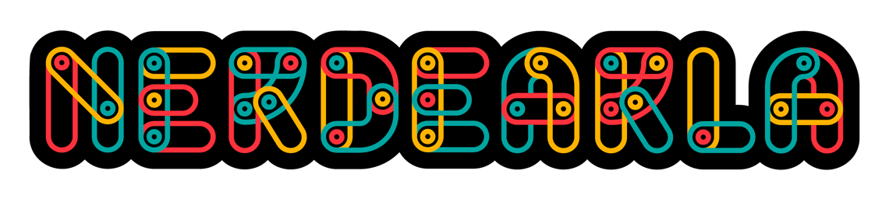

# Networking for dummies: Conectando Azure y AWS (Workshop Nerdearla)



## Indice

1. [Introduccion](#introduccion)
2. [Requisitos](#requisitos)
3. [Configuracion](#introduccion)

## Introduccion

En este repositorio vas a encontrar la definicion (Terraform, HCL) de todos los recursos de Azure y AWS mencionados y utilizados durante el workshop, por ejemplo:

* AWS VPC
* AWS Subnets
* AWS Internet Gateway y NAT Gateway
* AWS Route Tables
* AWS Security Groups
* AWS EC2 instance (VM)
* Azure Virtual Network
* Azure Subnets
* Azure Virtual machine
* y muchos otros mas...

## Requisitos

Para poder poner a prueba lo mencionado y explicado en este workshop, vamos a necesitar no solo una cuenta en [AWS](https://aws.amazon.com/es/console/) y en [Azure](https://azure.microsoft.com/en-us/get-started/azure-portal), sino tambien las siguientes herramientas instaladas y configuradas:

* AWS CLI
* Azure CLI
* Terraform

### Configuracion

```bash
#AWS
: '
Podes usar esta guia para crear un nuevo set de credenciales.
Vas a necesitar dichas credenciales en el siguiente paso.
https://docs.aws.amazon.com/IAM/latest/UserGuide/id_credentials_access-keys.html
'
aws configure

#AZURE
az login
```
